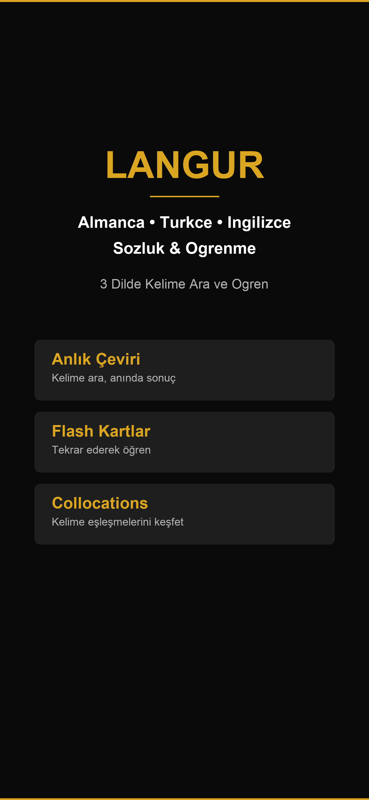
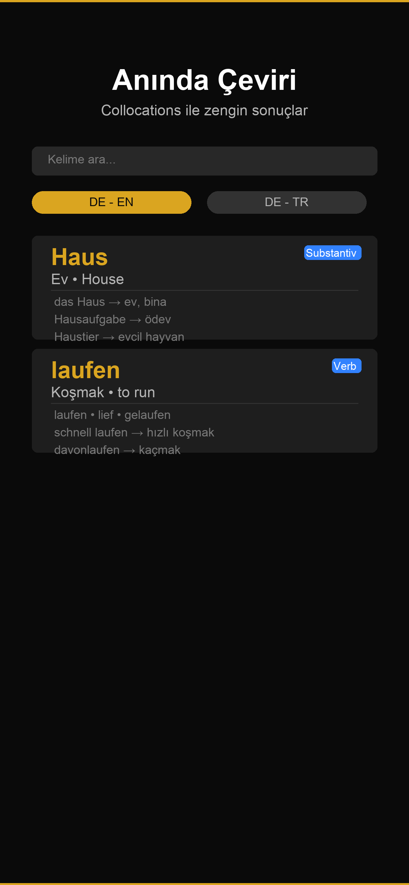
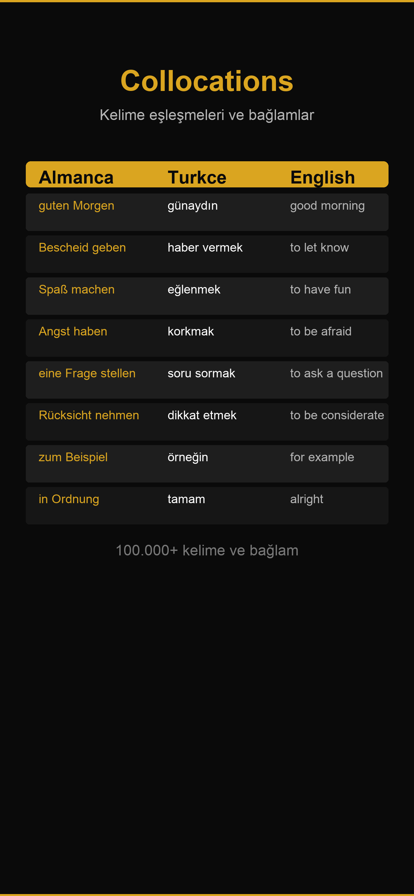
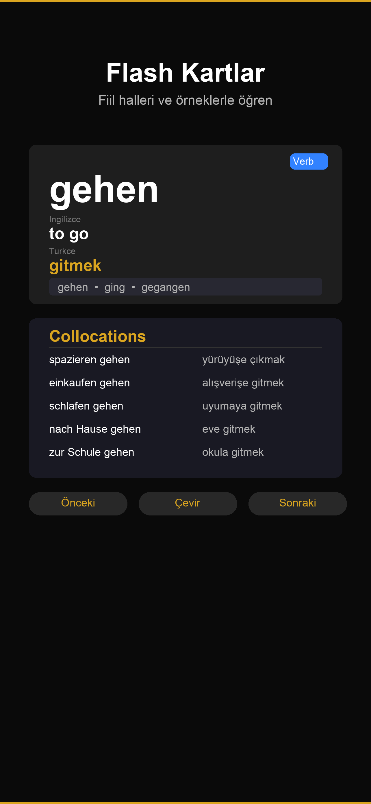
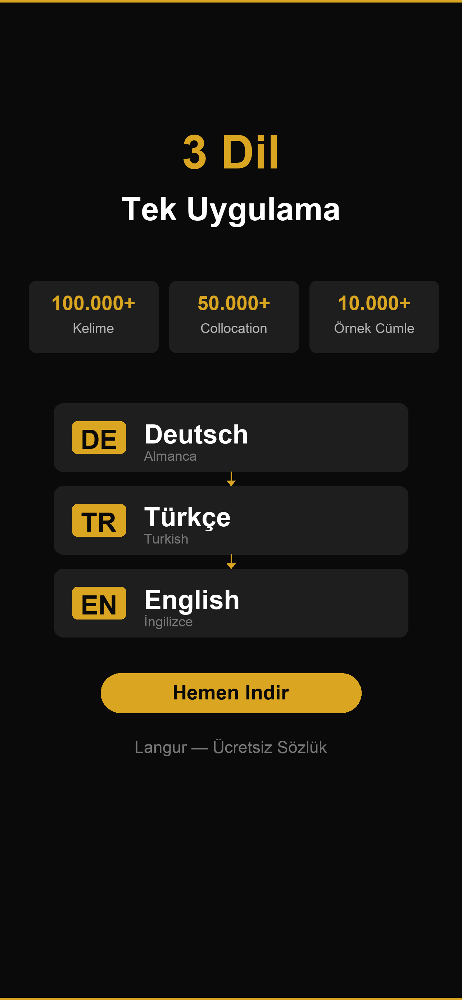

# Langur

### German · Turkish · English Dictionary

**Search, learn, and practice vocabulary in 3 languages — free iOS app**

 

---

## Screenshots

<table>
  <tr>
    <td></td>
    <td></td>
    <td></td>
    <td></td>
    <td></td>
  </tr>
  <tr>
    <td align="center"><b>Home</b></td>
    <td align="center"><b>Search</b></td>
    <td align="center"><b>Collocations</b></td>
    <td align="center"><b>Flash Cards</b></td>
    <td align="center"><b>Languages</b></td>
  </tr>
</table>

---

## Features

### Instant Translation
Search words instantly across German, Turkish, and English.

- **DE ↔ EN** — German · English
- **DE ↔ TR** — German · Turkish

### Collocations & Context
Every word comes with real-world collocations and example sentences — learn how words are actually used, not just what they mean.

| Deutsch | Türkçe | English |
|---------|--------|---------|
| guten Morgen | günaydın | good morning |
| Bescheid geben | haber vermek | to let know |
| Spaß machen | eğlenmek | to have fun |
| Angst haben | korkmak | to be afraid |
| eine Frage stellen | soru sormak | to ask a question |
| Rücksicht nehmen | dikkat etmek | to be considerate |
| zum Beispiel | örneğin | for example |
| in Ordnung | tamam | alright |

> **100,000+ words · 50,000+ collocations · 10,000+ example sentences**

### Flash Cards
Practice vocabulary with interactive flash cards:

- **Front:** Word + part of speech (Verb, Noun, Adj…)
- **Back:** Translations + verb conjugations + example sentence
- Filter cards by category to focus your study sessions

### Favorites & History
- Save words you love to your Favorites list
- Quickly jump back to recent searches from History

---

## Technical Info

| | |
|---|---|
| **Platform** | iOS 16.0+ |
| **Languages** | German, Turkish, English |
| **Price** | Free |
| **Developer** | Emircan Yayla |
| **Data Collection** | None — everything stays on your device |
| **Age Rating** | 4+ |

---

## Privacy

Langur **collects no personal data whatsoever**. The app runs fully on your device — no accounts, no cloud sync, no tracking.

Full details: [Privacy Policy](PRIVACY.md)

---

## Support & Contact

Found a bug or have a suggestion?

- Open an [Issue](https://github.com/emircanby/langur-support/issues) on GitHub
- Email: **emircanby@gmail.com**

---

© 2026 Emircan Yayla · All rights reserved

