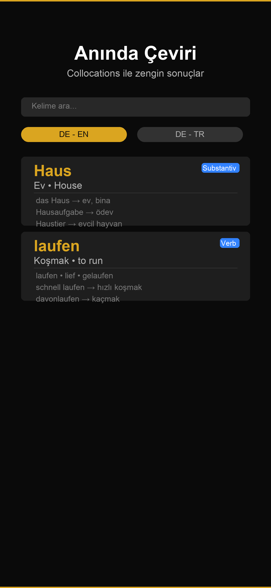
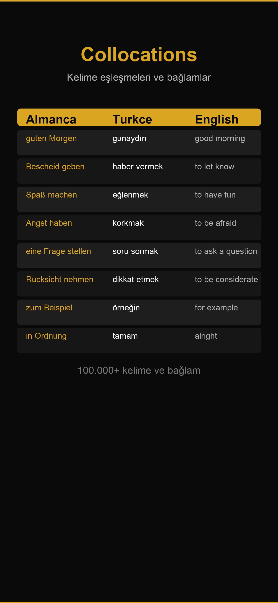
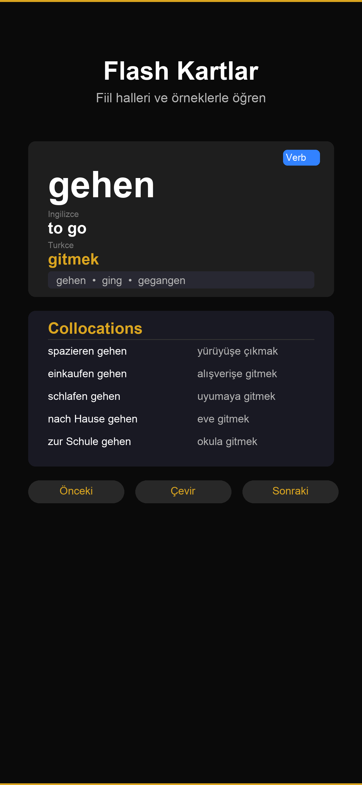

# Langur
### German · Turkish · English Dictionary
Search vocabulary, explore source-backed examples, and practice with flashcards.

**iOS 17+ · Offline dictionary · No account required**

## Explore the app

| Search | Word details | Practice |
|---|---|---|
|  |  |  |

*Screenshots show an earlier app version; the feature notes below reflect the latest local project.*

## What you can do

- Search German vocabulary with Turkish and English meanings, including reverse lookup.
- Find inflected forms and explore compound words and phrases.
- Read available collocations and source-backed example sentences.
- Tap words in example sentences to continue exploring the dictionary.
- Practice with flashcards and revisit favorites and search history.
- Use the bundled dictionary offline, without an account.

Not every dictionary entry has a translation or example in every language. Langur shows available source data rather than inventing missing content.

## Latest project changes — 1.0.5 (10)

The latest local project contains **115,395 dictionary entries** and example records for **21,121 entries**.

- Expanded lookup for inflected forms with an index loaded when needed.
- Added source-backed example records and clearer source attribution.
- Removed unverified generated verb conjugations and runtime enrichment.
- Removed the old account flow.
- Improved search responsiveness and reduced the recorded runtime bundle from 191 MB to 86 MB.
- Added visible error messages when a bundled dictionary resource cannot be loaded.

These notes describe the project snapshot; they do not confirm the current App Store release status. See [change history](CHANGELOG.html).

## Privacy and sources

Dictionary lookup uses bundled data. Favorites and history stay on your device. No account is required by the latest project.

- [Privacy policy](PRIVACY.html)
- Dictionary sources: WikDict/DBnary, Wiktionary and Kaikki.
- Example source: Tatoeba. Source and license attribution is also available in the app.

## Support

For bugs, missing translations or suggestions, [open an issue](https://github.com/emircanby/langur-support/issues) or email **emircanby@gmail.com**.

Include the app version, your language direction, the search term, and steps to reproduce the problem. Avoid including personal information in public issues.

Developer: **Emircan Yayla** · © 2026. All rights reserved.
